# <p align="center">Take-In-Stray 浪愛有家</p>  
### 專題簡介：  
```
現今許多民眾都會透過FB、IG等社群媒體來傳遞有關動物送養、協尋、救援等資訊，但通常容易被熱度較高及較新的資訊蓋過。
因此打算架設一個專門提供給會員可以刊登有關動物送養、寵物協尋、動物救援的資訊平台，讓動物們的資訊能更容易被看見，
令看到資訊有意願收養或救助的人可聯繫刊登者，來去幫助這些動物並領養他們。
```
### 功能描述：
```
1. 訪客可通過註冊成為會員，登入會員之後便可以刊登有關動物送養、寵物協尋、動物救援的資訊，並可對已刊登的資訊進行修改跟刪除。
2. 會員也可在會員資訊中修改個人資訊及密碼。
3. 管理員登入之後便可查看到所有會員的個人資訊(不含密碼)及所有已刊登的資訊，並可對兩者進行刪除。 
```
### 成品功能畫面：  
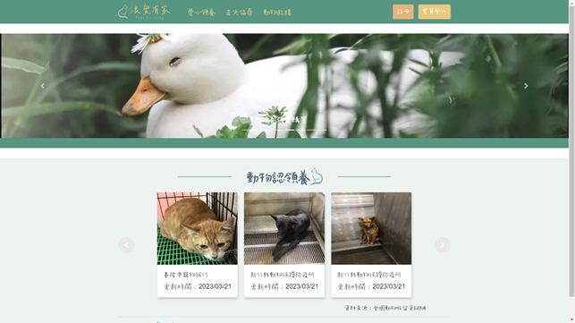
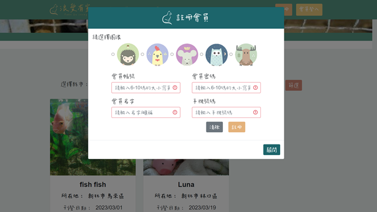
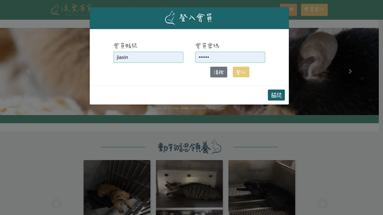

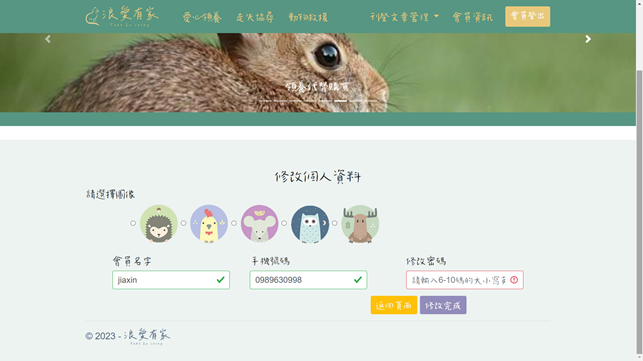
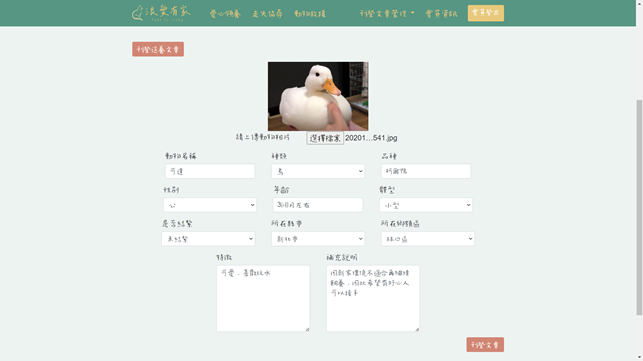
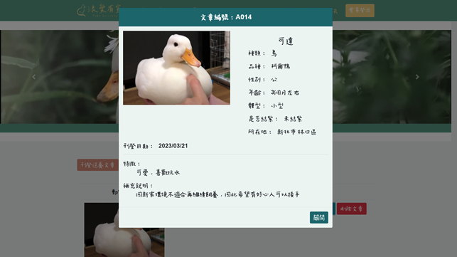
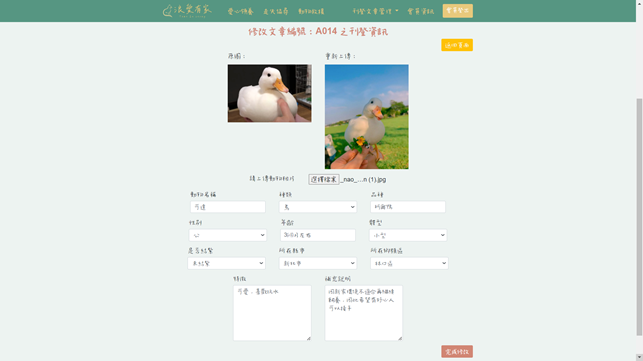
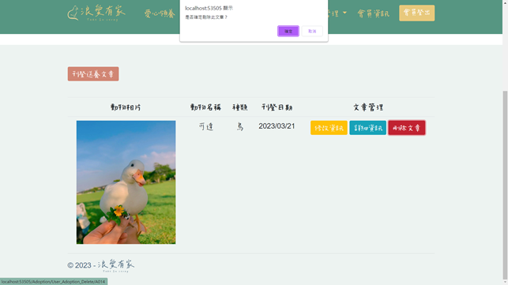
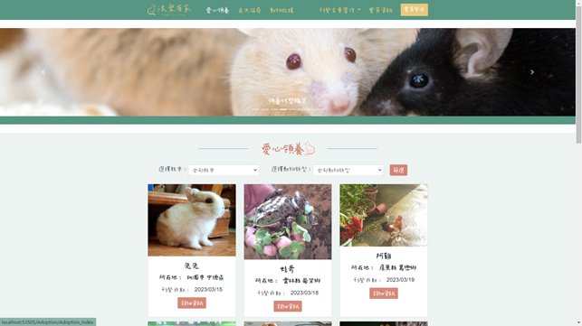
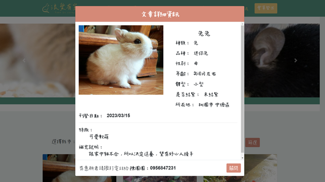
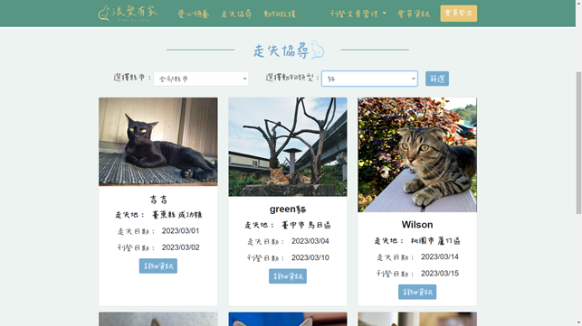
